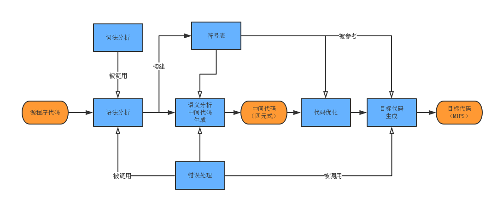

# Extended-PL-0 Compilter

文法 Syntax
---
```
/* 中文版 */
<程序>          ::=   <分程序>.
<分程序>        ::=   [<常量说明部分>][<变量说明部分>]{[<过程说明部分>]| [<函数说明部分>]}<复合语句>
<常量说明部分>  ::=   const<常量定义>{,<常量定义>};
<常量定义>      ::=    <标识符>＝ <常量>
<常量>          ::=    [+| -] <无符号整数>|<字符>
<字符>          ::=  '<字母>' | '<数字>'
<字符串>        ::= "{十进制编码为32,33,35-126的ASCII字符}"
<无符号整数>    ::=   <数字>{<数字>}
<标识符>        ::=   <字母>{<字母>|<数字>}
<变量说明部分>  ::=   var <变量说明> ; {<变量说明>;}
<变量说明>      ::=   <标识符>{, <标识符>} : <类型>
<类型>          ::=   <基本类型>|array'['<无符号整数>']' of <基本类型>
<基本类型>      ::=   integer | char
<过程说明部分>  ::=  <过程首部><分程序>{; <过程首部><分程序>};
<函数说明部分>  ::=  <函数首部><分程序>{; <函数首部><分程序>};
<过程首部>      ::=   procedure<标识符>[<形式参数表>];
<函数首部>      ::=   function <标识符>[<形式参数表>]: <基本类型>;
<形式参数表>    ::= '('<形式参数段>{; <形式参数段>}')'
<形式参数段>    ::=   [var]<标识符>{, <标识符>}: <基本类型>
<语句>          ::=   <赋值语句>|<条件语句>|<当循环语句>|<过程调用语句>|<复合语句>|<读语句>|<写语句>|<for循环语句>|<空>
<赋值语句>      ::=  <标识符> := <表达式>| <函数标识符> := <表达式> | <标识符>'['<表达式>']':= <表达式>
<函数标识符>    ::=  <标识符>
<表达式>        ::=   [+|-]<项>{<加法运算符><项>}
<项>            ::=   <因子>{<乘法运算符><因子>}
<因子>          ::=   <标识符>|<标识符>'['<表达式>']'|<无符号整数>| '('<表达式>')' | <函数调用语句>
<函数调用语句>  ::=   <标识符>[<实在参数表>]
<实在参数表>    ::= '(' <实在参数> {, <实在参数>}')'
<实在参数>      ::=   <表达式>
<加法运算符>    ::=   +|-
<乘法运算符>    ::=   *|/
<条件>          ::=   <表达式><关系运算符><表达式>
<关系运算符>    ::=   <|<=|>|>= |=|<>
<条件语句>      ::=   if<条件>then<语句> | if<条件>then<语句>else<语句>
<当循环语句>    ::=   do<语句> while<条件>
<for循环语句>   ::=   for <标识符>  := <表达式> （downto | to） <表达式> do <语句> //步长为1
<过程调用语句>  ::=  <标识符>[<实在参数表>]
<复合语句>      ::=   begin<语句>{; <语句>}end
<读语句>        ::=   read'('<标识符>{,<标识符>}')'
<写语句>        ::=   write'('<字符串>,<表达式>')'|write'('<字符串>')'|write'('<表达式>')'
<字母>          ::=   a|b|c|d…x|y|z |A|B…|Z
<数字>          ::=   0|1|2|3…8|9

/* in English */
<program>          		::=   <sub-program>.
<sub-program>        		::=   [<constant declaration>][<variable declaration>]{[<procedure declaration>]| [<function declaration>]}<multiple statements>
<constant declaration>  	::=   const<constant definition>{,<constant definition>};
<constant definition>      	::=    <identifier>＝ <constant>
<constant>          		::=    [+| -] <unsigned integer>|<character>
<character>          		::=  '<letter>' | '<number>'
<string>        		::= "{ASCII character #32,33,35-126}"
<unsigned integer>    		::=   <number>{<number>}
<identifier>        		::=   <letter>{<letter>|<number>}
<variable declaration>  	::=   var <variable definition> ; {<variable definition>;}
<variable definition>   	::=   <identifier>{, <identifier>} : <type>
<type>          		::=   <primitive type>|array'['<unsigned integer>']' of <primitive type>
<primitive type>      		::=   integer | char
<procedure declaration> 	::=  <procedure header><sub-program>{; <procedure header><sub-program>};
<function declaration>  	::=  <function header><sub-program>{; <function header><sub-program>};
<procedure header>      	::=   procedure<identifier>[<formal parameter list>];
<function header>      		::=   function <identifier>[<formal parameter list>]: <primitive type>;
<formal parameter list> 	::= '('<formal parameter>{; <formal parameter>}')'
<formal parameter>    		::=   [var]<identifier>{, <identifier>}: <primitive type>
<statement>          		::=   <assignment statement>|<conditional statement>|<while loop statement>|<procedure call statement>|<multiple statements>|<read statement>|<write statement>|<for loop statement>|<empty line>
<assignment statement>  	::=  <identifier> := <expression>| <function identifier> := <expression> | <identifier>'['<expression>']':= <expression>
<function identifier>   	::=  <identifier>
<expression>        		::=   [+|-]<term>{<adding operator><term>}
<term>            		::=   <factor>{<multiplication operator><factor>}
<factor>          		::=   <identifier>|<identifier>'['<expression>']'|<unsigned integer>| '('<expression>')' | <function call statement>
<function call statement>  	::=   <identifier>[<actual parameter list>]
<actual parameter list>    	::= '(' <actual parameter> {, <actual parameter>}')'
<actual parameter>      	::=   <expression>
<adding operator>    		::=   +|-
<multiplication operator>       ::=   *|/
<condition>          		::=   <expression><relation operator><expression>
<relation operator>    		::=   <|<=|>|>= |=|<>
<conditional statement>         ::=   if<condition>then<statement> | if<condition>then<statement>else<statement>
<while loop statement>    	::=   do<statement> while<condition>
<for loop statement>   		::=   for <identifier>  := <expression> （downto | to） <expression> do <statement> //default step length is 1
<procedure call statement>      ::=  <identifier>[<actual parameter list>]
<multiple statements>      	::=   begin<statement>{; <statement>}end
<read statement>        	::=   read'('<identifier>{,<identifier>}')'
<write statement>        	::=   write'('<string>,<expression>')'|write'('<string>')'|write'('<expression>')'
<letter>          		::=   a|b|c|d…x|y|z |A|B…|Z
<number>          		::=   0|1|2|3…8|9
```

目标代码说明 About object code
---
| 指令 instruction | 形式 formulation | 含义 description |
| :---: | :---: | :---: |
| j | j _label | 无条件跳转 |
| jal | jal func_label | 跳转并链接，用于过程、函数调用 |
| jr |jr $ra | 跳转至寄存器，用于调用返回 |
| beq | beq rs, rt, _label | 条件转移：相等 |
| bne | bne rs, rt, _label | 条件转移：不等 |
| bgtz | bgtz rs, rt, _label | 条件转移：大于 |
| bgez | bgez rs, rt, _label | 条件转移：大于等于 |
| bltz | bltz rs, rt, _label | 条件转移：小于等于 |
| blez | blez rs, rt, _label | 条件转移：小于 |
| add | add rd, rs, rt | 加法（寄存器+寄存器） |
| addi | addi rd, rs, immediate | 加法（寄存器+立即数） |
| sub | sub rd, rs, rt | 减法（寄存器-寄存器） |
| subi | subi rd, rs, rt | 减法（寄存器-立即数）|
| mult | mult rs, rt | 乘法（寄存器-寄存器）|
| div | div rs, rt | 除法（寄存器-寄存器）|
| mflo | mflo rd | 取lo寄存器值，用于取乘除结果|
| or | or rd, rs, rt | 按位或（寄存器 或 寄存器） |
| ori | ori rd, rs, immediate | 按位或（寄存器 或 立即数） |
| sll | sll rd, rt, s | 逻辑左移（寄存器 << 立即数）|
| sw | sw rt, offset(base) | 向内存存储字（1word = 32bit）|
| lw | lw rt, offset(base) | 从内存读取字（1word = 32bit）|
| li | li rt | 取立即数到寄存器 |
| la | la rt | 取内存地址到寄存器 |
| syscall | syscall | 系统调用，据$v0值进行不同操作 |
|.data | .data | 存储数据段信息（字符串） |

系统调用详细说明 About 'syscall' instruction

| 服务 Service | $v0 register value | 说明 description |
| :---: | :---: | :---: |
| Read integer | 5 | 取值作为整数存入$v0 |
| Read char | 12 | 取值作为字符存入$v0 |
| Print integer | 1 | 以整数打印$a0的值 |
| Print char | 11 | 以字符打印$a0的值 |
| Print string | 4 | 以$a0值为指针，打印其指向的string |

程序结构及主要流程 Structure and main process
---
| 模块 module | 对应源代码文件 source code file |
| :---: | :---: |
| 词法分析 | LexiconAnalysis.cpp |
| 语法分析 | SyntaxAnalysis.cpp |
| 符号表 | SymbolTable.cpp |
| 语义分析 | SemanticAnalysis.cpp |
| 目标代码生成 | ObjectCodeProducer.cpp, GeneralPurposeRegisters.cpp |
| 错误处理 | LexiconAnalysis.cpp |


```
参照上图，3遍扫描过程如下：
第1遍：扫描源程序，获得符号表与中间代码（两者在代码优化部分会有进一步完善，目标代码生成的）
    参与者：词法分析、语法分析、语义分析及中间代码生成、符号表、错误处理
    过程：
        （1）源程序代码读入;
        （2）进入语法分析程序，对源程序采用自顶向下递归的分析方式，调用[词法分析程序取词;
        （3）语义分析伴随语法分析过程中实现;
        （4）符号表伴随语法分析过程逐渐构建形成
    结果：基本完整的符号表和中间代码-四元式
	
第2遍：扫描中间代码，划分基本块并完善符号表
    参与者：符号表、代码优化、错误处理
    过程：
        （1）在中间代码上划分基本块
        （2）将中间代码包含的各子过程划分开，建立各子过程的基本块信息记录
        （3）对各子过程进行活跃变量分析和全局寄存器分配
        （4）对各子过程所用临时变量进行预先统计（实际分配在目标代码生成中完成），若出现临时寄存器不足的情况，则在符号表中添加伪寄存器的表项（即为临时寄存器预留空间），并调整四元式（将表示临时寄存器的_Tx置换为伪寄存器M_Tx）
    结果：符号表、中间代码

第3遍：扫描完善后的中间代码，结合符号表从而生成目标代码
    参与者：符号表、目标代码生成、错误处理
    过程：逐条读中间代码，生成实现相应功能的mips汇编代码
    结果：目标代码（MIPS汇编）
```

